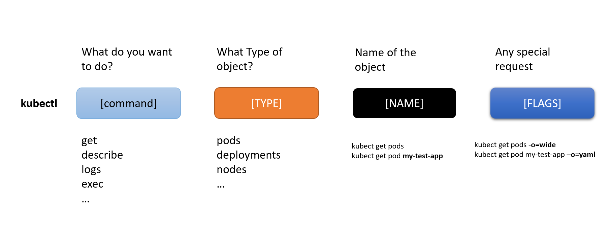

## First authorization

Kubectl stores its configuration file in a hidden directory
`$HOME/.kube/config`
Config file contains
   1. Target cluster name
   2. Credentials for the cluster

To use kubernetes kubectl command, we need to connect to kubernetes cluster. 
To view the configuration, we can either open the config file or we can use 
```
kubectl config view
```

#### Connecting to a Google Kubernetes Engine cluster 
```
gcloud container clusters \
get-credentials [CLUSTER_NAME] \
--zone [ZONE_NAME]
```
We need to configure only once per cluster. 

Once the `kubectl` command gets the credentials from home directory, we can use it. 'kubectl' is the administering tool for a current cluster. It can't change an existing cluster or create a new cluster. 


#### Kubectl command syntax

`kubectl` `[command]` `[TYPE]` `[NAME]` `[flags]`





## 1. Create Kubernetes Cluster


Create environment variable for zone and cluster name.

```
export my_zone=us-central1-a
export my_cluster=standard-cluster-1
```
Create a Kubernetes cluster.

```
gcloud container clusters create $my_cluster --num-nodes 3 --zone $my_zone --enable-ip-alias
```

Ref: [gcp docs](https://cloud.google.com/sdk/gcloud/reference/container/clusters/create)

## 2. Modify Cluster


Change the number of nodes to 4
```
gcloud container clusters resize $my_cluster --zone $my_zone --num-nodes=4
```

> Note: When issuing cluster commands, specify both the 
>   1. cluster name and 
>   2. the cluster location (region or zone)


### 3. Connect to a GKE cluster

- Use Cloud Shell to authenticate to a GKE cluster and 
- Inspect the kubectl configuration files.

Authentication in Kubernetes applies both to 
- communicating with the cluster from an external client through the kube-APIserver running on the master and 
- to cluster containers communicating within the cluster or externally. 

In Kubernetes, authentication can take several forms. 
- For GKE, authentication is typically handled with OAuth2 tokens and can be managed through Cloud Identity and Access Management across the project as a whole. 
- Optionally, through role-based access control which can be defined and configured within each cluster. 
- In GKE, cluster containers can use service accounts to authenticate to and access external resources.


To create a kubeconfig file with the credentials of the current user (to allow authentication) and provide the endpoint details for a specific cluster (to allow communicating with that cluster through the kubectl command-line tool), execute the following command:

```
gcloud container clusters get-credentials $my_cluster --zone $my_zone
```
> The above  command creates a .kube directory under the home directory (if it doesn't already exist). 
> 
> In the .kube directory, the command creates a file named config if it doesn't already exist, which is used to store the authentication and configuration information. 
> 
> The config file is typically called the **kubeconfig file**.

To check the kubeconfig file
```
nano ~/.kube/config
# I like just to cat, unless I want to edit
cat ~/.kube/config
```

### 4. Use kubectl to inspect a GKE cluster

We can use kubectl command to excute command against the cluster after the kubeconfig file is populated and the active context is set to a cluster.

To check the contents of kubeconfig file
```
kubectl config view
```
Cluster information for the active context
```
kubectl cluster-info
```

Information about active context

```
kubectl config current-context
```

> Output is of the format
> **gke_[PROJECT_ID]_us-central1-a_standard-cluster-1**

Get details for all the cluster contexts in the kubeconfig file.
_Note: This will not print everything, but will provide clusters created by the user and if anything was added manually._
```
kubectl config get-contexts
```

:) Change the active context
```
kubectl config use-context gke_${GOOGLE_CLOUD_PROJECT}_us-central1-a_standard-cluster-1
```

View the resource usage across the nodes of the cluster
```
kubectl top nodes
```

Information across all the deployed Pods in the cluster
```
kubectl top pods
```

**If you are using bash autocomplete feature for your day to day work, and you realize that autocomplete doesn't work in kubectl, it is a pain.** To use autocomplere with `kubectl`, run the command:
```
source <(kubectl completion bash)
```

### 5. Deploy Pods to GKE clusters

Kubernetes introduces the abstraction of a Pod to group one or more related containers as a single entity to be scheduled and deployed as a unit on the same node. 
You can deploy a Pod that is a single container from a single container image. Or a Pod can contain many containers from many container images.

In Cloud Shell, execute the following command to deploy nginx as a Pod named nginx-1:

```
kubectl create deployment --image nginx nginx-1
```

This command creates a Pod named nginx with a container running the nginx image. When a **repository isn't specified**, it will try to use an image either **locally** or in the **Docker public registry**. 

View all the deployed Pods in the active context cluster:

```
kubectl get pods
```

**Save pod name into a variable name:** Get your pod name from the above command.

```
export my_nginx_pod=[your_pod_name]

```


Now, view the complete details of the Pod you just created.

```
kubectl describe pod $my_nginx_pod
```


**Push a file into a container**

To be able to serve static content through the nginx web server, you must create and place a file into the container.

Create a sample test.html file

```
nano ~/test.html
```

```
<html> <header><title>This is title</title></header>
<body> Hello world </body>
</html>
```
Press **CTRL+X**, then press **Y** and enter to save the file and exit the nano editor.

In Cloud Shell, execute the following command to place the file into the appropriate location within the nginx container in the nginx Pod to be served statically:

```
kubectl cp ~/test.html $my_nginx_pod:/usr/share/nginx/html/test.html
```

This command copies the test.html file from the local home directory to the /usr/share/nginx/html directory of the first container in the nginx Pod. You could specify other containers in a multi-container Pod by using the -c option, followed by the name of the container.

Expose the Pod for testing
To expose a Pod to clients outside the cluster requires a service. Services are discussed elsewhere in the course and used extensively in other labs. You can use a simple command to create a service to expose a Pod.

In Cloud Shell, execute the following command to create a service to expose our nginx Pod externally:

kubectl expose pod $my_nginx_pod --port 80 --type LoadBalancer
Copied!
This command creates a LoadBalancer service, which allows the nginx Pod to accessed from internet addresses outside of the cluster.

In Cloud Shell, execute the following command to view details about services in the cluster:

kubectl get services
Copied!
The output should look like the following example. You use the external IP address in the next step.

Note: You might have to repeat the command a few times before the new service has its external IP populated.

Condensed Output (do not copy, edited to fit screen)

NAME             TYPE          CLUSTER-IP    EXTERNAL-IP  PORT(S)      AGE
kubernetes       ClusterIP     10.11.240.1   <none>       443/TCP       1h
nginx-1-7...wsc  LoadBalancer  10.11.240.87  <pending>    80:31695/TCP  3s
Copied!
The kubernetes service is one of the default services created or used by the cluster. The nginx service that you created is also displayed.

You may need to re-run this command several times before the External IP address is displayed.

Condensed Output (do not copy, edited to fit screen)

NAME             TYPE         CLUSTER-IP   EXTERNAL-IP    PORT(S)     AGE
kubernetes       ClusterIP    10.11.240.1  <none>         443/TCP      1h
nginx-1-7...wsc  LoadBalancer 10.11.240.87 104.154.177.46 80:31695/TCP 1m
Copied!
Click Check my progress to verify the objective.
Deploy Pods to GKE clusters

In Cloud Shell, execute the following command to verify that the nginx container is serving the static HTML file that you copied.
You replace [EXTERNAL_IP] with the external IP address of your service that you obtained from the output of the previous step.

curl http://[EXTERNAL_IP]/test.html
Copied!
The file contents appear in the output. You can go to the same address in your browser to see the file rendered as HTML.

Example (do not copy)

curl http://104.154.177.46/test.html
<html> <header><title>This is title</title></header>
<body> Hello world </body>
</html>
Copied!
In Cloud Shell, execute the following command to view the resources being used by the nginx Pod:

kubectl top pods
Copied!
Output (do not copy)

NAME                       CPU(cores)   MEMORY(bytes)
nginx-1-74c7bbdb84-nvwsc   0m           2Mi
Copied!
Task 6. Introspect GKE Pods
In this task, you connect to a Pod to adjust settings, edit files, and make other live changes to the Pod.

Important

Use this process only when troubleshooting or experimenting. Because the changes you make are not made to the source image of the Pod, they won't be present in any replicas.

Prepare the environment
The preferred way of deploying Pods and other resources to Kubernetes is through configuration files, which are sometimes called manifest files. Configuration files are typically written in the YAML syntax, specifying the details of the resource. With configuration files, you can more easily specify complex options than with a long line of command-line arguments. YAML syntax is similar to, but more concise than, JSON syntax and it enables the same kind of hierarchical structuring of objects and properties. The source repository for the lab contains sample YAML files that have been prepared for you.

In Cloud Shell enter the following command to clone the repository to the lab Cloud Shell.

git clone https://github.com/GoogleCloudPlatform/training-data-analyst
Copied!
Create a soft link as a shortcut to the working directory.

ln -s ~/training-data-analyst/courses/ak8s/v1.1 ~/ak8s
Copied!
Change to the directory that contains the sample files for this lab.

cd ~/ak8s/GKE_Shell/
Copied!
A sample manifest YAML file for a Pod called new-nginx-pod.yaml has been provided for you:

apiVersion: v1
kind: Pod
metadata:
  name: new-nginx
  labels:
    name: new-nginx
spec:
  containers:
  - name: new-nginx
    image: nginx
    ports:
    - containerPort: 80
Copied!
To deploy your manifest, execute the following command:

kubectl apply -f ./new-nginx-pod.yaml
Copied!
Click Check my progress to verify the objective.
Deploy manifest file for a Pod called new-nginx

To see a list of Pods, execute the following command:

kubectl get pods
Copied!
The output should look like the example.

Output (do not copy)

NAME                       READY     STATUS    RESTARTS   AGE
new-nginx                  1/1       Running   0          9s
nginx-1-74c7bbdb84-nvwsc   1/1       Running   0          55m
Copied!
You can see your new nginx Pod as well as the one we created earlier in the lab.

Use shell redirection to connect to a Pod
Some container images include a shell environment that you can launch. This shell environment might be more convenient than executing individual commands with kubectl. For instance, the nginx image includes a bash shell. In this task you use shell redirection to connect to the bash shell in your new nginx pod to carry out a sequence of actions.

In Cloud Shell, execute the following command to start an interactive bash shell in the nginx container:

kubectl exec -it new-nginx /bin/bash
Copied!
A new shell prompt appears.

Output (do not copy)

root@new-nginx:/#
Copied!
You have started an interactive bash shell in the container of the new-nginx Pod. If the Pod had several containers, you could specify one by name with the -c option.

Because the nginx container image has no text editing tools by default, you need to install one.

In Cloud Shell, in the nginx bash shell, execute the following commands to install the nano text editor:

apt-get update
apt-get install nano
Copied!
You need to create a test.html file in the static served directory on the nginx container.

In Cloud Shell, in the nginx bash shell, execute the following commands to switch to the static files directory and create a test.html file:

cd /usr/share/nginx/html
nano test.html
Copied!
In Cloud Shell, in the nginx bash shell nano session, type the following text:

<html> <header><title>This is title</title></header>
<body> Hello world </body>
</html>
Copied!
Press CTRL+X, then press Y and enter to save the file and exit the nano editor.

In Cloud Shell, in the nginx bash shell, execute the following command to exit the nginx bash shell:

exit
Copied!
To connect to and test the modified nginx container (with the new static HTML file), you could create a service. An easier way is to use port forwarding to connect to the Pod directly from Cloud Shell.

In Cloud Shell, execute the following command to set up port forwarding from Cloud Shell to the nginx Pod (from port 10081 of the Cloud Shell VM to port 80 of the nginx container):

kubectl port-forward new-nginx 10081:80
Copied!
The output should look like the example.

Output (do not copy)

Forwarding from 127.0.0.1:10081 -> 80
Forwarding from [::1]:10081 -> 80
Copied!
This is a foreground process, so you need to open another Cloud Shell instance to test.

In the Cloud Shell menu bar, click the plus sign (+) icon to start a new Cloud Shell session.
8996feb35b731abb.png

A second Cloud Shell session appears in your Cloud Shell window. You can switch between sessions by clicking the titles in the menu bar.

In the second Cloud Shell session, execute the following command to test the modified nginx container through the port forwarding:

curl http://127.0.0.1:10081/test.html
Copied!
The HTML text you placed in the test.html file is displayed.

<html> <header><title>This is title</title></header>
<body> Hello world </body>
</html>
Copied!
View the logs of a Pod
In the Cloud Shell menu bar, click the plus sign (+) icon to start another new Cloud Shell session.
A third Cloud Shell session appears in your Cloud Shell window. As before, you can switch sessions by clicking them in the menu bar.

In the third Cloud Shell window, execute the following command to display the logs and to stream new logs as they arrive (and also include timestamps) for the new-nginx Pod:

kubectl logs new-nginx -f --timestamps
Copied!
You will see the logs display in this new window
Return to the second Cloud Shell window and re-run the curl command to generate some traffic on the Pod.
Review the additional log messages as they appear in the third Cloud Shell window.
32096531a9e15126.png

Close the third Cloud Shell window to stop displaying the log messages.
Close the original Cloud Shell window to stop the port forwarding process.
End your lab